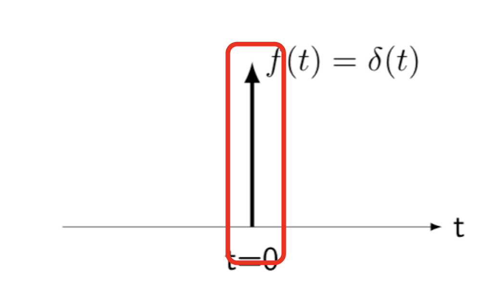

# Continuous and Discrete Signals

## Continuous & Discrete Signals

### Continuous Time Signals

- Most signals in real world
- e.g.) Voltage, Velocity
- Denoted by $$x(t)$$

### Discrete Time Signals

- Some real world and most of digital signals (since they are sampled)
- e.g.) pixels, daily stock price
- Denoted by $$x[n]$$, where $$n$$ is an integer value
- Continuous signal can be sampled with $$x[n] = x(nk)$$

## Generic Signal Energy and Power

### Total Energy

- Total Energy of a signal is given by
  - $$E = \int_{t_1}^{t_2} \|x(t)\|^2 \ dt$$ for continuous time signal $$x(t)$$
  - $$E = \sum_{n=n_1}^{n_2} \|x[n]\|^2$$for discrete time signal $$x[n]$$
- Average power $$P$$ can be computed by dividing $$E$$ by $$(t_2-t_1)$$ and $$(n_2-n_1+1)$$

### Energy and Power over Infinite Time

- Total energy over an infinite time interval $$(-\infty,\ \infty)$$ is defined by
  - $$E_\infty = \lim_{T\rightarrow\infty} \int_{-T}^{T} |x(t)|^2\ dt = \int_{-\infty}^{\infty} |x(t)|^2\ dt$$
  - $$E_\infty = \lim_{N\rightarrow\infty} \sum_{n=-N}^{N}|x[n]|^2 = \sum_{n=-\infty}^{\infty}|x[n]|^2$$
- Average power over infinite time interval is given by
  - $$P_\infty = \lim_{T\rightarrow\infty} \frac{1}{2T}\int_{-T}^{T} |x(t)|^2\ dt$$
  - $$P_\infty = \lim_{N\rightarrow\infty} \frac{1}{2N+1} \sum_{n=-N}^{N}|x[n]|^2$$
- Finite total energy means zero average power
- Finite Average power means infinite total energy

## Time Shift Signal Transformations

### Time Shift

- A linear time shift signal transformation is given by $y = x(at+b)$
- $$b$$ represents a signal offset from $$0$$
- a signal
  - stretches if $$\|a\| > 1$$
  - compresses if $$0 < \|a\| < 1$$
  - reflects if $$a< 0$$

### Periodic Signals

- A signal is periodic if $$x(t) = x(t+T)\;\text{for all}\; t\; \text{and}\; T> 0$$
- Sinusoidal signals are periodic
  - $$\sin(x),\ \cos(x)$$
- Example

  - $$x(t) = e^{j(\frac{2}{3}\pi)t}+e^{j(\frac{3}{4}\pi)t}$$ is periodic signal with period of $$24$$
  - $$x(n) = e^{j(\frac{2}{3}\pi)n}+e^{j(\frac{3}{4}\pi)n}$$ is periodic if $$n = 24m$$ (where $$m$$ is an integer)

    $$
    T_1 = \frac{2\pi}{2\pi/3}= 3,\;
    T_2 = \frac{2\pi}{3\pi/4}= \frac{8}{3}, \;
    \text{lcm}(T_1,T_2)=24
    $$

## Exponential and Sinusoidal Signals

### Exponential Functions

- Exponential signal is a basis of a Fourier series and Fourier transform
- A generic complex exponential signal is given by $$x(t) = Ce^{at}$$
  - where $$C$$ and $$a$$ are complex numbers

### Sinusoidal Signals

- Suppose $$a$$ is purely imaginary, that is, $$a = \alpha +j\omega_0 = j\omega_0$$ ($$\alpha=0$$)
- By Euler’s relationship, a exponential signal can be expressed as

$$
x(t) = e^{j\omega_0t} = \cos\omega_0t + j\sin\omega_0t
$$

- $$x(t)$$ is periodic signal when $$T = \frac{2\pi}{\omega_0}$$ is the time period
  - $$\omega_0$$ is the fundamental frequency
  - $$T_0$$ is the fundamental time period $$(T_0 = \frac{2\pi}{\omega_0})$$
- Also, it is always held that
  - $$A\cos(\omega_0t+\phi) = A\Re(e^{j(\omega_0t+\phi)})$$
  - $$A\sin(\omega_0t+\phi) = A\Im(e^{j(\omega_0t+\phi)})$$

### Properties

- A energy over one period is given by

$$
E_{period} = \int_0^{T_0}|e^{j\omega_0t}|^2\ dt = \int_0^{T_0} dt = T_0
$$

$$
|e^{j\omega_0t}| = |\cos\omega_0t+j\sin\omega_0t| = \sqrt{\cos^2\omega_0t+\sin^2\omega_0t} = 1
$$

- Therefore, average power over a period is given by

$$
P_{period} = \frac{1}{T_0}E_{period} = 1
$$

- Example
  - Compute the magnitude of the signal $$x(t) = e^{j2t} + e^{j3t}$$
    $$
    \begin{align*}
    x(t) &= e^{j2.5t}(e^{-j0.5t}+e^{j0.5t})\\
    & = e^{j2.5t}(\cos(-0.5t)+j\sin(-0.5t) + \cos(0.5t)+j\sin(0.5t))\\
    &=e^{j2.5t}\times 2\cos(0.5t)
    \end{align*}\\
    $$
    $$
    |x(t)| = |e^{j2.5t}||2\cos(0.5t)| = 2|\cos(0.5t)|
    $$
  - Therefore, the magnitude of the signal is $$2$$

## Unit Impulse and Step Signals

### Discrete

- Unit impulse signal is defined by

$$
x[n]=\delta[n] = \begin{cases}0\;\;\; n \neq 0\\ 1 \;\;\; n = 0\end{cases}
$$

- Unit step signal is defined by

$$
x[n]=u[n] = \begin{cases}0\;\;\;n<0\\ 1\;\;\; n\ge0\end{cases}
$$

- Also, $$\delta[n] = u[n] - u[n-1]$$ (the first difference of the step signal)

### Continuous

- Unit impulse signal is defined by

$$
x(t)=\delta(t) = \begin{cases}0\;\;\;t\neq0\\1\;\;\;t=0\end{cases}
$$

- Unit step signal is defined by

$$
\begin{align*}
x(t) &= u(t) = \int_{-\infty}^{t}\delta(\tau)\ d\tau\\
&= \begin{cases}0\;\;\;t<0\\1\;\;\;t>0\end{cases}
\end{align*}
$$

- Both unit impulse signal and step signal is discontinuous at $$t=0$$

## Impulse Singals

### Dirac’s Delta Function

- Very large near $$t=0$$
- Very small far from $$t=0$$
- has integral of $$1$$
- Plotted with a solid arrow

### Formal Definition

- Formally, $$\delta$$ is defined by the property that

$$
\int_a^b f(t)\delta(t)dt = f(0)
$$

- Properties
  - $$\delta(t) = 0$$ for $$t\neq0$$
  - $$\delta(0)$$ is not really defined
  - $$\int_a^b \delta(t)dt = 1$$ if $$a <0$$ and $$b> 0$$
  - $$\int_a^b\delta(t)dt =0$$ if $$a>0$$ or $$b  <0$$
  - $$\delta(\alpha t) = \frac{1}{|\alpha|}\delta(t)$$
  - $$\delta(t) = \delta(-t)$$ (even function)
  - $$\delta(t) = \frac{d}{dt}u(t)$$ (relationship between unit impulse and step function)
  - $$f(t)\delta(t)=f(0)\delta(t)$$ (sampling property)
  - The property holds same for discrete-time impulse function

### Scaled and Shifted Impulse

- A scaled and time-shifted impulse can be expressed as $$\alpha\delta(t-T)$$
- It is an impulse at time $$T$$, with a magnitude $$\alpha$$
- we have $$\int_a^b\alpha\delta(t-T)f(t)dt = \alpha f(T)$$ ($$a<T<b$$ and $$f$$ continuous at $$T$$)
