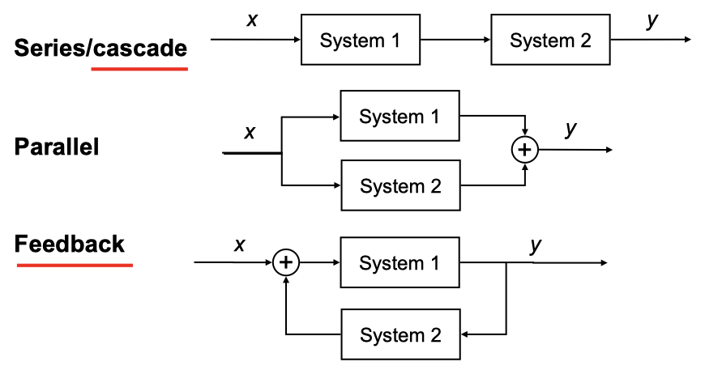

# Properties of Signals

## Named Signals

- Constant (static or DC) : $u(t) = a$ or $u[n] = a$
- Unit Step

$$
u(t) = \begin{cases}
0 \;\; (t < 0)\\
1 \;\; (t \ge 0)\end{cases},\;\;
u[n] = \begin{cases}
0 \;\; (n < 0)\\
1 \;\; (n \ge 0) \end{cases}
$$

- Unit ramp: $r(t) = t\cdot u(t)$ or $r[n] = n\cdot u[n]$ where $u$ is a unit step signal
- Sinusoidal: $f(t) =a\cos(\omega t + \phi) +b$ or $f[n] = a\cos(\omega n+\phi)+b$
- Complex exponential $f(t) = Ae^{st}$ or $f[n]=Ae^{sn}$
  - By Euler’s relation, complex exponential and sinusoidal signals are equivalent
  - Magnitude: $$\|f\| = \sqrt{\Re^2\{f\} + \Im^2\{f\}}$$

## Properties of System

### Linearity

- To be a linear system, two properties must be satisfied
  - Additive: $x_1(t)+x_2(t) \rightarrow y_1(t)+y_2(t)$
  - Scaling: $ax_1(t) \rightarrow ay_1(t)$ where $a\in \mathbb{C}$
  - If $ax_1(t)+bx_2(t) \rightarrow ay_1(t)+by_2(t)$, then the system is linear
- Examples
  - $y(t) = tx(t)$ (Linear)
    - $x_3(t) = ax_1(t)+bx_2(t)$ → $y_3(t) = tx_3(t) = atx_1(t) + btx_2(t) = ay_1(t)+by_2(t)$
  - $y(t) = x^2(t)$ (non-linear)
    - $x_1(t)  \rightarrow y_1(t)$
    - $x_2(t) \rightarrow y_2(t)$
    - $x_3(t) =ax_1(t)+bx_2(t) \rightarrow y_3(t)=x^2_3(t)$
    - $x_3^2(t) = a^2x_1^2(t) +b^2x_2^2(t) + 2abx_1(t)x_2(t) \neq a^2x_1^2(t) +b^2x_2^2(t) = ay_1(t) +by_2(t)$
  - $y[n] = \Re\{x[n]\}$ when $x_1[n] = r[n] + js[n]$ (non-linear)
    - outputs only real component $(r[n])$ of the input
    - $x_2[n] = jx_1[n] = -s[n] + jr[n]$ (scaled by $a =j)$
    - $x_2[n]\rightarrow y_2[n] =-s[n] \neq jr[n] = j \cdot y_1[n]$
- Although sytstem might be non-linear, we can transform into an equivalent linear system in a small local range (linearization)
- **Superposition**
  - If an input signal $x[n]$ is made of a linear sum $x[n]= \sum_ka_kx_k[n]$
  - Then, the response $y[n]$ is given by $y[n] = \sum_ka_ky_k[n]$
  - The property holds for both continuous and discrete signals

### Time Invariance

- A system is time invariant if its characteristics are fixed over time
- That is, $y(t-T) = f(t-T)$, a time shift does not change the result change
  - If $x(t) \rightarrow y(t)$, then $x(t-t_0)\rightarrow y(t-t_0)$
- $y(t) = x(2t)$ where $x_2(t) = x_1(t-2)$ (Time-variant)

  $$
  \begin{align*}
  &y_2(t)= x_2(2t)=x_1(2t-2)=y_1(t-1)\\
  &x_1(t-2) \rightarrow y_1(t-1) \;\; \therefore \text{time variant}
  \end{align*}
  $$

- $y[n] = nx[n]$ (Time variant)
  - if $x_1[n] = \delta[n]$, then $y_1[n] = n \times \delta[n] = 0$ for all $n$
    - if $n= 0$, $0 \times \delta[0] = 0 \times 1 = 0$
    - if $n \neq0$, $n \times \delta[n]=n \times 0 = 0$
  - if $x_2[n]=\delta[n-1]$, then $y_2[n] = n\delta[n-1] = \delta[n-1]$
    - if $n=1$, then $y_2[1] = 1\times\delta[0]=1$
    - if $n\neq 1$, then $y_2[n] = n\times 0 = 0$
  - Therefore, $y[n]=nx[n]$ is time varying

### Memorylessness

- A system is memoryless if its output at given time is dependent on the same time (present)
- If a system requires information from the past, then it is not memoryless
  - $y[n] =\sum_{k=-\infty}^{n}x[k]$ is a system with memory (accumulator)
  - $y[n] =\sum_{k=-\infty}^{n-1}x[k] + x[n] = y[n-1] + x[n]$ is a system with memory
- If a system is memoryless, then it is also causal (memoryless $\sub$ causal)

### Causality

- A system is causal if the output at any time depends on values of the output at only the present and past time
  - An accumulator $y[n]=\sum_{k=-\infty}^nx[k]$ is causal (and with memory)
  - The average filtering system $y[n] = \frac{1}{2M+1}\sum_{k=-\infty}^{M} x[n-k]$ is non-causal
    - The system requires future input for averaging

### Stability

- A system is stable if output is bounded for all input signal
- Formally, $$\forall x: \|x\|<U \rightarrow\|y\|<V$$ : for bounded input, output must be bounded
- Although only one bounded input signal makes output unbounded, then the system is unstable
- $y[n]=x[n]+1.01y[n-1]$ is unstable since it grows without bound
  - if $x[n] = \delta[n]$, then $0  \le x\le 1$ (bounded)
  - however, due to $1.01y[n-1]$ term, $y$ is unbounded
  - Therefore, the system is unstable

### Invertiblity

- A system is invertible if distinct input lead to distinct output
  - only one input exists for each unique output
- $y(t)=2x(t)$ is invertible since the inverse system $w(t)=0.5y(t)$ exists
- $y(t) = x^2(t)$ is not invertible because distinct input ($\pm x$) lead to the same output($x^2$)

### Structures

