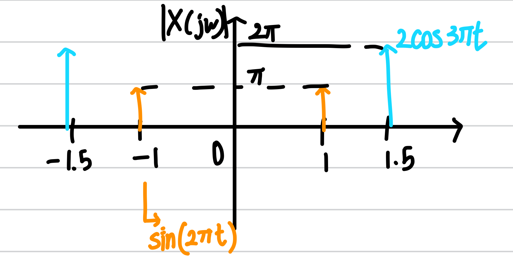

# Fourier Transform의 직관적 해석

## Fourier Transform의 의미

Fourier Transform은 Time-domain에서의 signal을 frequency-domain에서의 함수로 변환해주는 역할을 한다.
그러나 이 문장이 정확히 무엇을 말하는지 이해하는 것은 쉽지 않다.

우선 간단하게 말하자면, Fourier Transform은 signal을 frequency를 $$\omega$$인 주기함수의 합이라고 할때 해당 frequency의 주기함수의 **세기**를 나타낸다.

쉬운 예시를 생각해보자. 만약 $$\sin(2\pi t) + 2\cos(3\pi t)$$라는 signal이 있다고 하자. 이 signal은 frequency가 각각 1, 1.5인 주기함수의 합이다. 그렇다면 각 주기함수의 세기는 어떻게 결정되는지 생각해보아야 한다.

각 성분의 세기는 푸리에 변환 결과의 절댓값을 씌우므로서 알 수 있다. Fourier transform의 결과 $$X(j\omega)$$는 복소함수이므로, 이의 세기를 구하기 위해서는 절댓값을 취해주어야한다. 이제 우리는 Fourier Transform에서 $$\omega$$의 의미와 세기를 이해했으므로 한번에 직관적 이해를 더해보자.

Fourier Transform의 결과가 복소함수인 만큼 직관적 이해를 위해서는 그 크기, $$\|X(j\omega)\|$$를 plotting 한다고 가정하자. 앞선 예시에 따르면 해당 signal은 frequency가 1, 1.5인 성분밖에 없으므로, 해당 \frequency를 제외하면 0이 될 것이다. 정확히는, $$\pm1,\ \pm1.5$$를 제외하고 0이 될 것이다. 그리고 그 세기는, $$\pm1.5$$ 성분의 값이 2배 더 강할 것이다. 왜냐하면, time-domain에서의 세기가 더 강하기 때문이다.

이러한 결과를 종합해보면, $$\|X(j\omega)\|$$ 의 그래프는 다음과 같이 그려진다.

또 다른 예시로 상수함수 $$x(t) = 1$$을 생각해보자. 상수함수는 frequency가 0인 주기함수로 생각해볼 수 있다. 따라서, 이 경우, $$\mathcal{F}\{x(t)\} = \delta(\omega)$$와 같이 $$\omega = 0$$인 성분만으로 분해된다.

## 비주기 함수의 Fourier Transform

비주기 함수의 예로 Rectangular signal과 그의 Fourier transform pair인 $$\text{sinc}$$ function 을 생각해보자.

$$
x(t) = \begin{cases} A & \|t\| \le T_1\\ 0 & \|t\| > T_1\end{cases} \Leftrightarrow X(j\omega) = \frac{2A\sin(T_1 \omega)}{\pi\ \omega}
$$

Fourier Transform의 Duality에 의하여 다음의 관계를 얻을 수 있다.

$$
 X(t) = \frac{2A\sin(\omega_0 t)}{\pi\ t} \Leftrightarrow 2\pi x(j\omega) = \begin{cases} 2\pi A & \|\omega\| \le \omega_0\\ 0 & \|\omega\| > \omega_0\end{cases}
$$

$$X(t) =  \frac{2A\sin(\omega_0 t)}{\pi\ t}$$에서 $$X(t)$$는 $$\omega_0 t = 2n\pi$$일 때, 0이 됨을 알 수 있다. 따라서, X(t)와 같은 Rectangular signal을 주기함수로 분해되었을 때, frequency가 가질 수 있는 최댓값은 $\omega_0$일 것이다. 그렇다면, $$X(t)$$의 Fourier Transform $$x(j\omega)$$는 $$\omega > \omega_0$$에서 0이 됨을 유추할 수 있고, 이는 실제 결과와 일치한다.

정확한 결과는 모르지만, 대략적인 개형에 대한 정보는 얻을 수 있다.

또한, $$\tilde{X}(t) = (X(t))^2$$의 Fourier Transform은 $$x(j\omega)$$의 convolution을 통해 직접 계산해 볼 수 있고, 그 결과는

$$
\tilde{x}(j\omega) = \frac{1}{2\pi} A(2\omega_0-|t|)
$$

로 triangular function이 나온다. 이 경우, $$\tilde{x}(j\omega)$$는 $$\|\omega\| > 2\omega_0$$에서 0이 된다.
그런데, 이를 간단한 방법으로 알 수 있다.
먼저,

$$
\begin{align*}
\tilde{X}(t) &= \frac{4A^2}{\pi^2} \frac{sin^2(\omega_0 t)}{t^2}\\
&= \frac{4A^2}{\pi^2} \frac{1-\cos(2\omega_0 t)}{2t^2}
\end{align*}
$$

임을 계산해보자. 여기서 우리는 상수함수 1은 $$\delta(\omega)$$의 꼴로 Fourier Transform 될 것임을 유추할 수 있고, 남은 $$\cos(2\omega_0 t)$$은 앞선 우리의 추측을 그대로 적용시켜보면, 그의 Fourier Transform은 $$\|\omega\| > 2\omega_0$$ 에서 0이 될 것이다.

이는 직접 Convolution을 계산한 결과와 일치한다.

이와 같이 Frequency에 대한 간단한 분석으로 Fourier Transform에 대한 대략적 정보를 추출할 수 있다.
