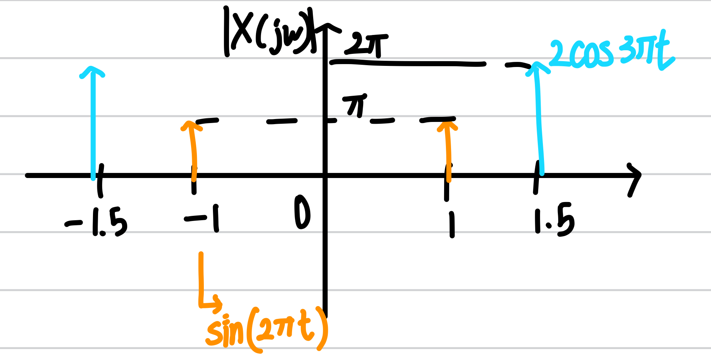

# Fourier Transform의 직관적 해석

## Fourier Transform의 의미

Fourier Transform은 Time-domain에서의 signal을 frequency-domain에서의 함수로 변환해주는 역할을 한다.
그러나 이 문장이 정확히 무엇을 말하는지 이해하는 것은 쉽지 않다.

우선 간단하게 말하자면, Fourier Transform은 signal을 frequency를 $$\omega$$인 주기함수의 합이라고 할때 해당 frequency의 주기함수의 **세기**를 나타낸다.

쉬운 예시를 생각해보자. 만약 $$\sin(2\pi t) + 2\cos(3\pi t)$$라는 signal이 있다고 하자. 이 signal은 frequency가 각각 1, 1.5인 주기함수의 합이다. 그렇다면 각 주기함수의 세기는 어떻게 결정되는지 생각해보아야 한다.

각 성분의 세기는 푸리에 변환 결과의 절댓값을 씌우므로서 알 수 있다. Fourier transform의 결과 $$X(j\omega)$$는 복소함수이므로, 이의 세기를 구하기 위해서는 절댓값을 취해주어야한다. 이제 우리는 Fourier Transform에서 $$\omega$$의 의미와 세기를 이해했으므로 한번에 직관적 이해를 더해보자.

Fourier Transform의 결과가 복소함수인 만큼 직관적 이해를 위해서는 그 크기, $$|X(j\omega)|$$를 plotting 한다고 가정하자. 앞선 예시에 따르면 해당 signal은 frequency가 1, 1.5인 성분밖에 없으므로, 해당 \frequency를 제외하면 0이 될 것이다. 정확히는, $$\pm1,\ \pm1.5$$를 제외하고 0이 될 것이다. 그리고 그 세기는, $$\pm1.5$$ 성분의 값이 2배 더 강할 것이다. 왜냐하면, time-domain에서의 세기가 더 강하기 때문이다.

이러한 결과를 종합해보면, $$|X(j\omega)|$$의 그래프는 다음과 같이 그려진다.

## 비주기 함수의 Fourier Transform

주기가 0
